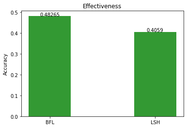
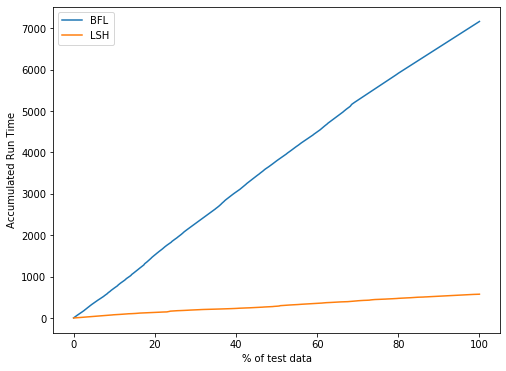
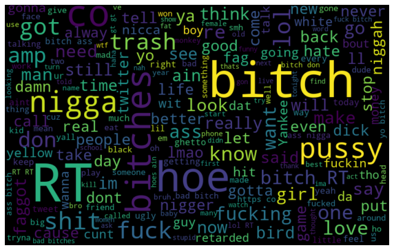
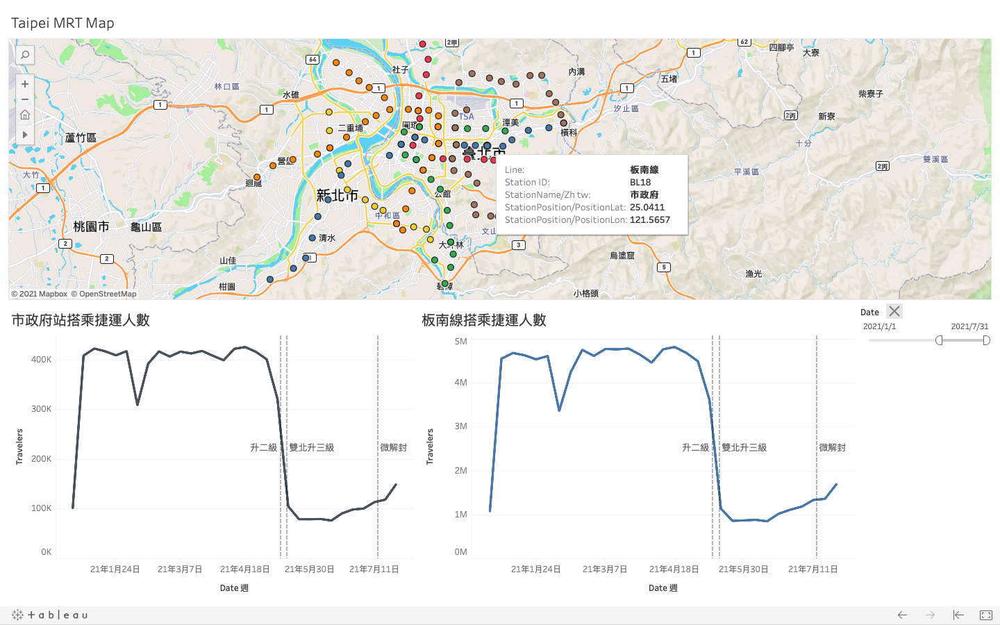
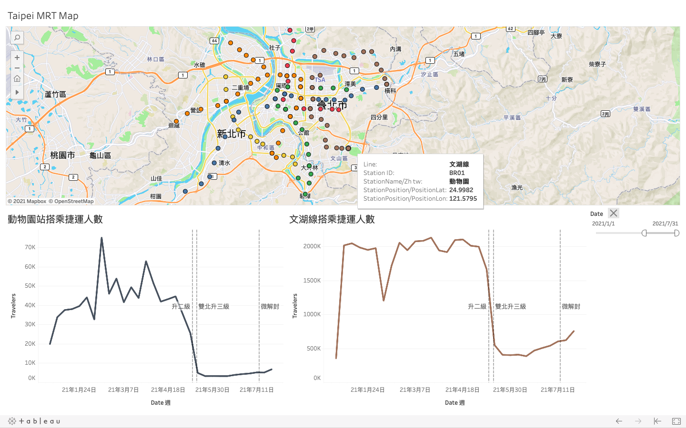
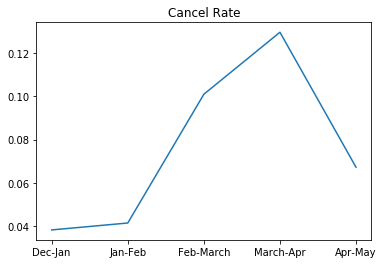
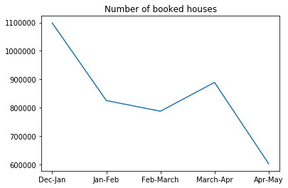
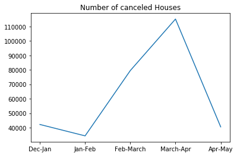

## Data Science Projects
### Project1: [Implement KNN with BFL and LSH](https://github.com/weicheng-su/Implement_KNN_with_BFL_and_LSH/blob/master/LSH_vs_Brute_Force_on_KNN.ipynb)

- Implemented KNN with brute-force linear search (BFL) and Locality-sensitive hashing search (LSH), and compared their effectiveness and efficiency. 
- Changed LSH hyperparameters to observe the performance change via plots.

 
### Project2: [Twitter Hate Speech Detection](https://github.com/weicheng-su/Twitter_Hate_Speech_Detection)
- Implemented text mining to classify the hate speech in twitter
- Coducted the skills including bag of words, TF-IDF, word clouds, SVM classifier
- Earned the third rank in the class
<!--  -->

 
### Project3: [Taipei Subway Ridership Visualization](https://public.tableau.com/views/MRT_Project_v3/Dashboard2?:language=zh-TW&:display_count=n&:origin=viz_share_link)
- Utilized Tableau to visualize the subway ridership changes during the COVID-19 pandemic in Taipei
- Created an interactive chart that user can click the station on map and then observe the ridership changes of the station and the whole line

<!-- Show the images side-by-side (did not work) -->
<!-- 

  
   

 -->

- The ridership change of the "Taipei City Hall Station"（市政府站) and the "Blue Line"（板南線）
 

- The ridership change of the "Taipei Zoo Station"（動物園站) and the "Brown Line"（文湖線）

 
### Project4: [How Much Did Covid-19 Affect the Airbnb on Booking Houses (Based on New York)](https://github.com/weicheng-su/Airbnb_Project/blob/master/airbnb_New_York_2019_Dec_to_2020_May.ipynb)
- Analyzed the data from [inside Airbnb](http://insideairbnb.com/get-the-data.html) during December 2019 to May 2020.
- Created plots to show how much did the booking decrease due to the covid-19 pandemic.

- March to April has the highest **cancel rate**, which matches the time of the covid-19 pandemic outbreak in New York.
- The cancel rate during March to April is about **0.13**, which is really high. Compare to the Dec-Jan and Jan-Feb, they only have around **0.04** cancel rate.

 

- The total numbers of how many houses people booked had decreased sharply, from 1.1 million houses to 600 thousand house.

 

- The total number of people who canceled their bookings during March-April is 110000, which is the highest among all, and it's about three times of the number of canceled houses on Dec-Jan and Jan-Feb.
- We can observe that the covid-19 did cause the Airbnb to lose a lot of bookings.

 
### Project5: [E.SUN Bank Fraud Detection Competition](https://github.com/weicheng-su/E.SUN_Bank_Fraud_Detection_Competition/blob/master/E.SUN_Bank_random_forest.ipynb)
- A competition held by E.SUN bank to detect fraud credit card behaviors.
- Implemented skills including data exploration, cleaning and modeling

 
### Contact Me
- [My LinkedIn](https://www.linkedin.com/in/wei-cheng-su/)
- [My Github](https://github.com/weicheng-su)
- [E-mail](mailto:leo.wc.su@gmail.com): leo.wc.su@gmail.com
